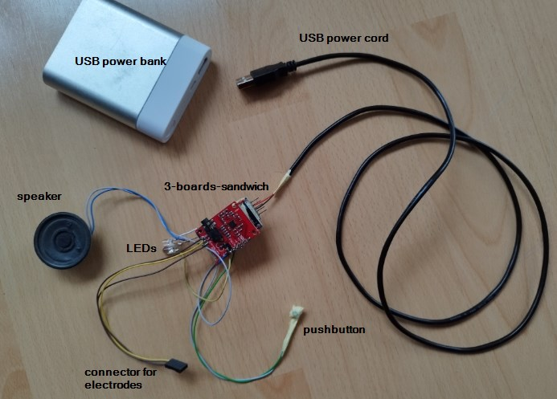
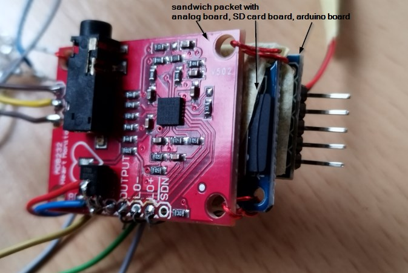
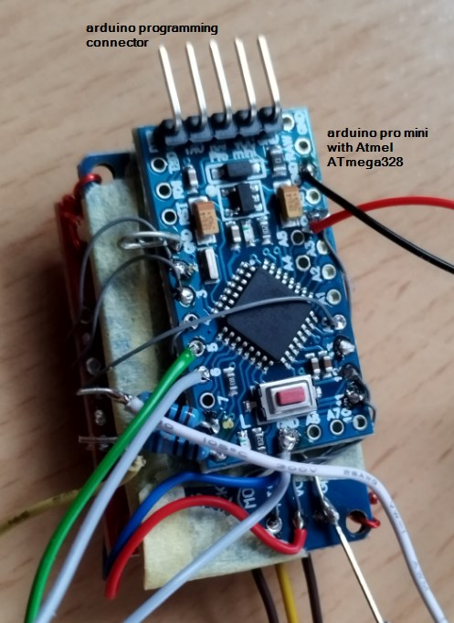
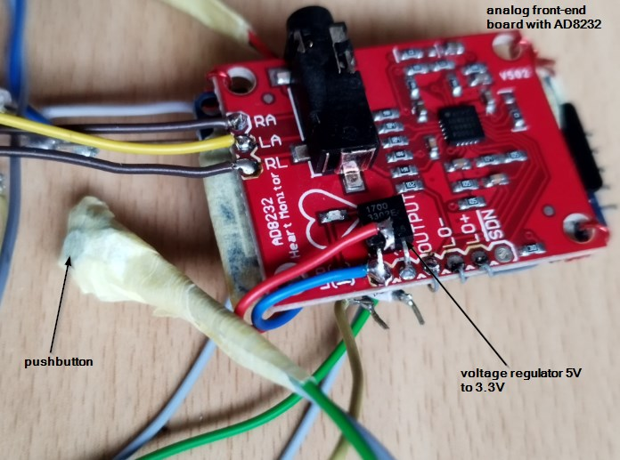
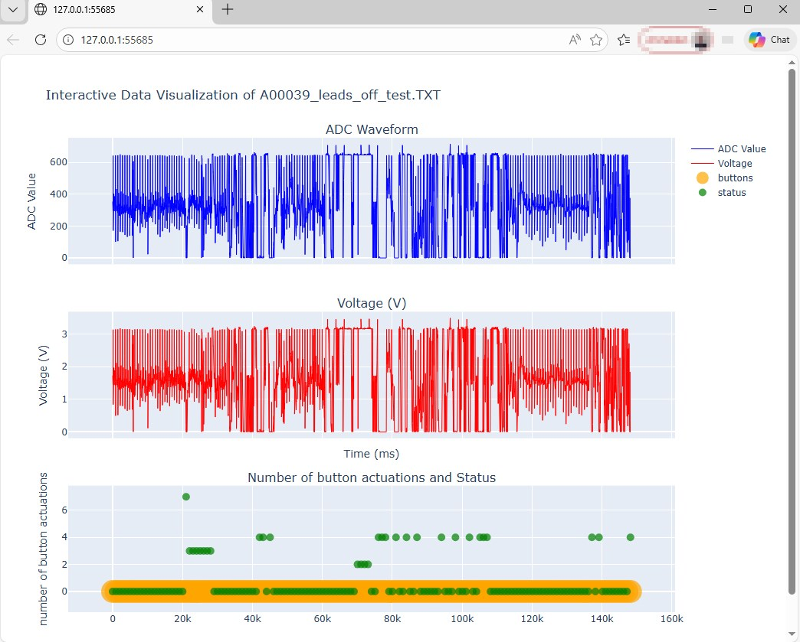

# Recording analog data, storing to SD card as csv, and interactive Visualization

Purpose: Record an analog channel and some digital status lines for multiple hours, with a
sample rate of 500Hz. Practical example: heart rate recording. Store the data on a micro-SD card.
On PC, show the data as diagrams and let the user zoom and pan.

## System overview

- Analog front-end with AD8232 "Single-Lead, Heart Rate Monitor Front End". This provides an analog signal and two digital "leads-off" status signals.
- Pushbutton to allow the user to mark interesting events
- Arduino pro mini board. This reads the analog and digital input signals, talks to the SD card board via SPI, and controls the LEDs and the speaker.
- LEDs: One red LED for showing the error state, and one white LED to show the activity.
- Speaker: Beep-tone informs about the status and the activity
- USB power bank as power supply
- Micro-SD card for data storage. One CSV file per power-on cycle, and after 15 minutes of recording.
- On PC: Python script and Web browser to visualize the data

## Pictures






## How to start the visualization?

1. Copy the interesting data file from SD card to local drive, in the same folder where the visualize.py lives.
2. Adjust the file name in visualize.py
3. In a command window:

```
C:\projects\arduino-promini-analog-to-sdcard\python>python visualize.py
Choose visualization method:
1. Basic plot
2. Detailed analysis (3 subplots)
3. Interactive plot (Plotly)
5. Save plot to file

Enter choice (1-6): 3
```

The plotly will open a browser window and show the data.
Zooming and panning is possible with mouse-wheel, drag-zoom and double-click.



## Data sheet

[ad8232_datasheet_heart_rate_monitor_frontend.pdf](doc/ad8232_datasheet_heart_rate_monitor_frontend.pdf)

## Software Step 1: Measurements of "simple approach"

Precondition: AD conversion and writing to SD card are in the same task.

Result: Even if the average sample interval is near to the intended 1ms, there are bigger gaps
cause by the blocking nature of the SD card write access.

```
min sample time [s] 0.0009999999999763531
max sample time [s] 0.05000000000001137
avg sample time [s] 0.0011597428387528127
recorded time   [s] 929.7379999999999
number of samples longer than 2ms 35230
number of samples longer than 3ms 20813
number of samples longer than 5ms 7703
number of samples longer than 10ms 1780
```

## Software Step 2: Interrupt-triggered recording

* use interrupt-based AD conversion, to get stable 1ms(?) sample time, independend from longer SD card operations


